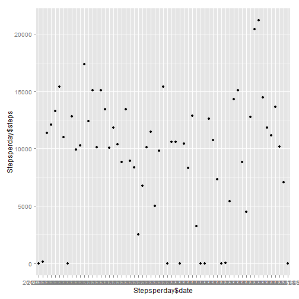
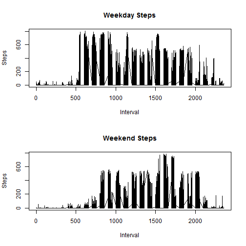

Note: As the assignment did not ask for the plots to be "pretty", in the interest of time, I did not expend much effort into appearance, focusing on the substance instead.  Recognizing that you may have reviewed other more "polished" submissions, I respectfully ask not to reduce my grade based on appearance. 

Loading and preprocessing the data
Show any code that is needed to
1.	Load the data (i.e. read.csv())


```r
activity <- read.csv("~/R/Reproducible Research/activity.csv")
```

2. Process/transform the data (if necessary) into a format suitable for your analysis

Step not necessary

What is mean total number of steps taken per day?
For this part of the assignment, you can ignore the missing values in the dataset.
1.	Calculate the total number of steps taken per day


```r
library(plyr)
ddply(activity,"date",numcolwise(sum),na.rm=TRUE)
```

```
##          date steps interval
## 1  2012-10-01     0   339120
## 2  2012-10-02   126   339120
## 3  2012-10-03 11352   339120
## 4  2012-10-04 12116   339120
## 5  2012-10-05 13294   339120
## 6  2012-10-06 15420   339120
## 7  2012-10-07 11015   339120
## 8  2012-10-08     0   339120
## 9  2012-10-09 12811   339120
## 10 2012-10-10  9900   339120
## 11 2012-10-11 10304   339120
## 12 2012-10-12 17382   339120
## 13 2012-10-13 12426   339120
## 14 2012-10-14 15098   339120
## 15 2012-10-15 10139   339120
## 16 2012-10-16 15084   339120
## 17 2012-10-17 13452   339120
## 18 2012-10-18 10056   339120
## 19 2012-10-19 11829   339120
## 20 2012-10-20 10395   339120
## 21 2012-10-21  8821   339120
## 22 2012-10-22 13460   339120
## 23 2012-10-23  8918   339120
## 24 2012-10-24  8355   339120
## 25 2012-10-25  2492   339120
## 26 2012-10-26  6778   339120
## 27 2012-10-27 10119   339120
## 28 2012-10-28 11458   339120
## 29 2012-10-29  5018   339120
## 30 2012-10-30  9819   339120
## 31 2012-10-31 15414   339120
## 32 2012-11-01     0   339120
## 33 2012-11-02 10600   339120
## 34 2012-11-03 10571   339120
## 35 2012-11-04     0   339120
## 36 2012-11-05 10439   339120
## 37 2012-11-06  8334   339120
## 38 2012-11-07 12883   339120
## 39 2012-11-08  3219   339120
## 40 2012-11-09     0   339120
## 41 2012-11-10     0   339120
## 42 2012-11-11 12608   339120
## 43 2012-11-12 10765   339120
## 44 2012-11-13  7336   339120
## 45 2012-11-14     0   339120
## 46 2012-11-15    41   339120
## 47 2012-11-16  5441   339120
## 48 2012-11-17 14339   339120
## 49 2012-11-18 15110   339120
## 50 2012-11-19  8841   339120
## 51 2012-11-20  4472   339120
## 52 2012-11-21 12787   339120
## 53 2012-11-22 20427   339120
## 54 2012-11-23 21194   339120
## 55 2012-11-24 14478   339120
## 56 2012-11-25 11834   339120
## 57 2012-11-26 11162   339120
## 58 2012-11-27 13646   339120
## 59 2012-11-28 10183   339120
## 60 2012-11-29  7047   339120
## 61 2012-11-30     0   339120
```

2.	If you do not understand the difference between a histogram and a barplot, research the difference between them. Make a histogram of the total number of steps taken each day


```r
library(ggplot2)

Stepsperday<-ddply(activity,"date",numcolwise(sum),na.rm=TRUE)

qplot(Stepsperday$date,Stepsperday$steps,Stepsperday)
```

 
3.	Calculate and report the mean and median of the total number of steps taken per day

```r
summary(Stepsperday$steps)
```

```
##    Min. 1st Qu.  Median    Mean 3rd Qu.    Max. 
##       0    6778   10400    9354   12810   21190
```
Results: 
Min. 1st Qu.  Median    Mean 3rd Qu.    Max. 
      0    6778   10400    9354   12810   21190 

What is the average daily activity pattern?
1.	Make a time series plot (i.e. type = "l") of the 5-minute interval (x-axis) and the average number of steps taken, averaged across all days (y-axis)

```r
intervalplot<-ddply(activity,"interval",numcolwise(mean),na.rm=TRUE)
plot(intervalplot$interval,intervalplot$steps,type="l",xlab="Interval", ylab="Steps")
```

 
2.	Which 5-minute interval, on average across all the days in the dataset, contains the maximum number of steps?

I have sorted the plot by steps to get to the maximum

```r
sortedplot<-intervalplot[order(intervalplot$steps),]
sortedplot
```

```
##     interval       steps
## 9         40   0.0000000
## 17       120   0.0000000
## 24       155   0.0000000
## 25       200   0.0000000
## 26       205   0.0000000
## 28       215   0.0000000
## 29       220   0.0000000
## 31       230   0.0000000
## 33       240   0.0000000
## 34       245   0.0000000
## 37       300   0.0000000
## 38       305   0.0000000
## 39       310   0.0000000
## 40       315   0.0000000
## 47       350   0.0000000
## 48       355   0.0000000
## 52       415   0.0000000
## 61       500   0.0000000
## 279     2310   0.0000000
## 5         20   0.0754717
## 46       345   0.0754717
## 274     2245   0.1132075
## 3         10   0.1320755
## 12        55   0.1320755
## 30       225   0.1320755
## 4         15   0.1509434
## 15       110   0.1509434
## 20       135   0.1698113
## 21       140   0.1698113
## 41       320   0.2075472
## 32       235   0.2264151
## 287     2350   0.2264151
## 23       150   0.2641509
## 11        50   0.3018868
## 13       100   0.3207547
## 273     2240   0.3207547
## 2          5   0.3396226
## 16       115   0.3396226
## 53       420   0.3396226
## 54       425   0.3584906
## 22       145   0.3773585
## 45       340   0.4905660
## 7         30   0.5283019
## 44       335   0.5849057
## 42       325   0.6226415
## 286     2345   0.6415094
## 56       435   0.6603774
## 14       105   0.6792453
## 58       445   0.8301887
## 280     2315   0.8301887
## 8         35   0.8679245
## 36       255   0.9433962
## 50       405   0.9433962
## 281     2320   0.9622642
## 288     2355   1.0754717
## 18       125   1.1132075
## 60       455   1.1132075
## 27       210   1.1320755
## 49       400   1.1886792
## 265     2200   1.4528302
## 10        45   1.4716981
## 35       250   1.5471698
## 62       505   1.5660377
## 282     2325   1.5849057
## 275     2250   1.6037736
## 43       330   1.6226415
## 1          0   1.7169811
## 19       130   1.8301887
## 6         25   2.0943396
## 67       530   2.0943396
## 272     2235   2.2075472
## 64       515   2.2452830
## 51       410   2.5660377
## 283     2330   2.6037736
## 264     2155   2.6226415
## 278     2305   2.8490566
## 66       525   2.9622642
## 63       510   3.0000000
## 59       450   3.1132075
## 277     2300   3.3018868
## 285     2340   3.3018868
## 65       520   3.3207547
## 57       440   3.4905660
## 266     2205   3.6792453
## 55       430   4.1132075
## 276     2255   4.6037736
## 284     2335   4.6981132
## 267     2210   4.8113208
## 68       535   6.0566038
## 269     2220   7.0754717
## 262     2145   7.7924528
## 258     2125   8.0188679
## 263     2150   8.1320755
## 268     2215   8.5094340
## 261     2140   8.6792453
## 270     2225   8.6981132
## 271     2230   9.7547170
## 257     2120  12.4528302
## 259     2130  14.6603774
## 253     2100  15.9433962
## 69       540  16.0188679
## 260     2135  16.3018868
## 177     1440  17.1132075
## 254     2105  17.2264151
## 70       545  18.3396226
## 242     2005  19.0188679
## 256     2115  19.2452830
## 243     2010  19.3396226
## 249     2040  19.5471698
## 241     2000  19.6226415
## 252     2055  20.1509434
## 234     1925  20.7169811
## 120      955  21.0566038
## 246     2025  21.1698113
## 135     1110  21.3207547
## 250     2045  21.3207547
## 248     2035  21.3396226
## 255     2110  23.4528302
## 117      940  24.7924528
## 131     1050  25.0943396
## 164     1335  25.1320755
## 136     1115  25.5471698
## 238     1945  25.5471698
## 178     1445  26.0754717
## 138     1125  26.4716981
## 153     1240  26.5283019
## 245     2020  26.8113208
## 122     1005  26.9811321
## 247     2030  27.3018868
## 235     1930  27.3962264
## 176     1435  27.5094340
## 130     1045  28.3396226
## 137     1120  28.3773585
## 134     1105  29.6792453
## 181     1500  30.0188679
## 237     1940  30.2075472
## 133     1100  31.3584906
## 73       600  31.4905660
## 132     1055  31.9433962
## 251     2050  32.3018868
## 152     1235  32.4150943
## 244     2015  33.3396226
## 139     1130  33.4339623
## 240     1955  33.5283019
## 129     1040  34.6981132
## 215     1750  34.7735849
## 119      950  34.9811321
## 173     1420  35.4716981
## 183     1510  35.4905660
## 182     1505  36.0754717
## 233     1920  36.3207547
## 83       650  37.3584906
## 128     1035  37.4150943
## 216     1755  37.4528302
## 174     1425  37.5471698
## 154     1245  37.7358491
## 200     1635  38.5660377
## 118      945  38.7547170
## 184     1515  38.8490566
## 125     1020  38.9245283
## 80       635  39.3396226
## 71       550  39.4528302
## 158     1305  39.8867925
## 165     1340  39.9622642
## 236     1935  40.0188679
## 121     1000  40.5660377
## 217     1800  40.6792453
## 160     1315  40.9811321
## 175     1430  41.8490566
## 141     1140  42.0377358
## 157     1300  42.3396226
## 123     1010  42.4150943
## 163     1330  42.7547170
## 159     1310  43.2641509
## 171     1410  43.5849057
## 179     1450  43.6226415
## 204     1655  43.6792453
## 180     1455  43.7735849
## 85       700  43.8113208
## 199     1630  43.8679245
## 81       640  44.0188679
## 82       645  44.1698113
## 127     1030  44.2830189
## 92       735  44.3207547
## 86       705  44.3773585
## 72       555  44.4905660
## 142     1145  44.6037736
## 201     1640  44.6603774
## 155     1250  45.0566038
## 116      935  45.2264151
## 202     1645  45.4528302
## 239     1950  45.6603774
## 185     1520  45.9622642
## 143     1150  46.0377358
## 203     1650  46.2075472
## 161     1320  46.2452830
## 205     1700  46.6226415
## 78       625  47.0754717
## 167     1350  47.3207547
## 186     1525  47.7547170
## 187     1530  48.1320755
## 172     1415  48.6981132
## 84       655  49.0377358
## 74       605  49.2641509
## 89       720  49.9245283
## 77       620  49.9622642
## 140     1135  49.9811321
## 150     1225  50.1698113
## 87       710  50.5094340
## 207     1710  50.7169811
## 126     1025  50.7924528
## 90       725  50.9811321
## 170     1405  51.9622642
## 79       630  52.1509434
## 93       740  52.2641509
## 124     1015  52.6603774
## 232     1915  53.3584906
## 166     1345  53.5471698
## 75       610  53.7735849
## 151     1230  54.4716981
## 88       715  54.5094340
## 91       730  55.6792453
## 169     1400  55.7547170
## 96       755  56.1509434
## 206     1705  56.3018868
## 162     1325  56.4339623
## 214     1745  56.5094340
## 197     1620  56.9056604
## 95       750  57.8490566
## 218     1805  58.0188679
## 231     1910  58.0377358
## 144     1155  59.1886792
## 221     1820  59.2641509
## 212     1735  59.6603774
## 198     1625  59.7735849
## 168     1355  60.8113208
## 208     1715  61.2264151
## 193     1600  62.1320755
## 196     1615  63.1698113
## 149     1220  63.3962264
## 76       615  63.4528302
## 145     1200  63.8679245
## 194     1605  64.1320755
## 188     1535  65.3207547
## 115      930  66.2075472
## 156     1255  67.2830189
## 222     1825  67.7735849
## 98       805  68.2075472
## 211     1730  68.9433962
## 94       745  69.5471698
## 209     1720  72.7169811
## 97       800  73.3773585
## 224     1835  74.2452830
## 195     1610  74.5471698
## 219     1810  74.6981132
## 213     1740  75.0943396
## 223     1830  77.6981132
## 230     1905  77.8301887
## 210     1725  78.9433962
## 189     1540  82.9056604
## 192     1555  83.9622642
## 229     1900  84.8679245
## 220     1815  85.3207547
## 225     1840  85.3396226
## 228     1855  85.6037736
## 227     1850  86.5849057
## 146     1205  87.6981132
## 148     1215  92.7735849
## 147     1210  94.8490566
## 114      925  95.9622642
## 190     1545  98.6603774
## 226     1845  99.4528302
## 191     1550 102.1132075
## 113      920 103.7169811
## 112      915 108.1132075
## 111      910 109.1132075
## 110      905 124.0377358
## 99       810 129.4339623
## 109      900 143.4528302
## 102      825 155.3962264
## 100      815 157.5283019
## 108      855 167.0188679
## 101      820 171.1509434
## 103      830 177.3018868
## 106      845 179.5660377
## 107      850 183.3962264
## 105      840 195.9245283
## 104      835 206.1698113
```
8:35-8:40 with the total of 206.2 steps

Imputing missing values

Note that there are a number of days/intervals where there are missing values (coded as NA). The presence of missing days may introduce bias into some calculations or summaries of the data.

1.	Calculate and report the total number of missing values in the dataset (i.e. the total number of rows withNAs)


```r
sum(is.na(activity$steps))
```

```
## [1] 2304
```
2304 total missing values

2.	Devise a strategy for filling in all of the missing values in the dataset. The strategy does not need to be sophisticated. For example, you could use the mean/median for that day, or the mean for that 5-minute interval, etc.

The approach I took below entails the following: 
a. put together a new data set with mean values for each interval
b. merge data sets via interval field
c. substitute NA values in steps column with values from meansteps column

```r
intervalmean<-aggregate(activity[,"steps"],list(activity$interval),mean,na.rm=TRUE)
colnames(intervalmean)[colnames(intervalmean)=="Group.1"] <- "interval"
colnames(intervalmean)[colnames(intervalmean)=="x"] <- "meansteps"
```
3.	Create a new dataset that is equal to the original dataset but with the missing data filled in.

```r
activity2<-merge(activity,intervalmean,by="interval")
activity2$steps[is.na(activity2$steps)]<-as.numeric(activity2$meansteps[is.na(activity2$steps)])
```

4.	Make a histogram of the total number of steps taken each day and Calculate and report the mean and median total number of steps taken per day. Do these values differ from the estimates from the first part of the assignment? What is the impact of imputing missing data on the estimates of the total daily number of steps?

```r
Stepsperday2<-ddply(activity2,"date",numcolwise(sum),na.rm=TRUE)
qplot(Stepsperday2$date,Stepsperday2$steps,Stepsperday2)
```

 

```r
summary(Stepsperday2$steps)
```

```
##    Min. 1st Qu.  Median    Mean 3rd Qu.    Max. 
##      41    9819   10770   10770   12810   21190
```
Min. 1st Qu.  Median    Mean 3rd Qu.    Max. 
     41    9819   10770   10770   12810   21190 

The values obviously differ from the estimates from the first part of the assignment.  Both mean and median are slightly higher due to imputing missing data.  

Are there differences in activity patterns between weekdays and weekends?
For this part the weekdays() function may be of some help here. Use the dataset with the filled-in missing values for this part.
1.	Create a new factor variable in the dataset with two levels - "weekday" and "weekend" indicating whether a given date is a weekday or weekend day.


```r
library(timeDate)
activity2$day<-ifelse(isWeekday(activity2$date),"weekday","weekend")
```

2.	Make a panel plot containing a time series plot (i.e. type = "l") of the 5-minute interval (x-axis) and the average number of steps taken, averaged across all weekday days or weekend days (y-axis). See the README file in the GitHub repository to see an example of what this plot should look like using simulated data.

```r
par(mfcol=c(2,1))

p1<-plot(subset(activity2$interval,activity2$day=="weekday"),subset(activity2$steps,activity2$day=="weekday"),type="l",xlab="Interval", ylab="Steps",main="Weekday Steps")

p2<-plot(subset(activity2$interval,activity2$day=="weekend"),subset(activity2$steps,activity2$day=="weekend"),type="l",xlab="Interval", ylab="Steps", main="Weekend Steps")
```

 
